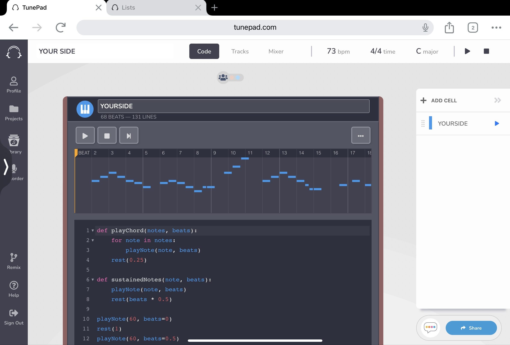

# You-Side

The project seeks to reinterpret the Chinese pop ballad 'You Will Be By My Side' through coding. I will create a piece that resonates with the essence of the original song, expressing my personal emotions by Python programming language - saying goodbye to the past while looking forward to the future. For me, the song represents hope and serves as an inspiration to maintain faith in life. Through this work, I aim to convey my feeling and experiences in a musical format, sharing a message of positivity.

# Table of Content
- [Introduction](#introduction)
- [Features](#features)
- [Technologies Used](#technologies)
- [Screenshot](#screenshot)
- [Usage](#usage)

# Introduction

- **Problem Solved**

This project aims to express emotions through music, helping people find hope and courage when facing life’s challenges. The original song reflects expectations for the future and a farewell to the past. I hope to reinterpret it through TunePad, allowing more people to experience this positive emotion.

- **Purpose of the Project**

The main goal is to use Python to create a musical piece that resonates with the original song and reflects my personal emotional journey. Through music, I aim to express my love for life, acceptance of the past, and vision for the future, inspiring others to maintain faith and move forward bravely.

- **Reason for the Project**

This project is driven by the profound impact this song has had on my life, providing me with hope and courage during difficult times. By transforming these feelings into code and music, I hope to share this power and inspiration with others, allowing them to feel the same uplifting emotions when they listen to it

# Technologies

- **Programming Language**: Python
- **Development Tool**: TunePad
- **Version Control**： GitHub

# Screenshot


# Usage

- `playChord`: The function is defined to play chords at appropriate positions. For example, to play F and G major chord, can use:

    ```python
    from tunepad import playChord

    # Play a F and G major chord
        playChord(['65', '69', '72'], beats = 0.5)
        playChord(['67', '71', '74'], beats = 0.5) # Melodic variations are introduced, using chords to enrich the musicial texture.
    ```

- `sustainedNotes`: The function adds sustained notes, enhancing the melody's dynamics. Here’s an example of playing a G2 note for 0.5 seconds:

    ```python
    from tunepad import sustainedNotes

    # Play the note G2 for 0.5 seconds
    sustainedNotes('56', beats= 0.5)
    ```

- `playNote`: The function allows to play individual notes. For example, to play the note G3:

    ```python
    from tunepad import playNote

    # Play the note G3
    playNote(67, beats = 0.5) # note should be play for a duration of 0.5 beats.
    ```

- `rest`: The function introduces pauses in music. For instance, use it to pause for 0.25 second:

    ```python
    from tunepad import rest

    # Rest for 0.25 second
    rest(0.25)
    ```
- `for _ in range`: A cyclic structure repeats certain melodic segments for cohesion. Here’s an example of using a loop to repeat a melody:
    ```python
    from TunePad import for _ in range
    
    # for _ in range(1): # Repeat the melody 1 times
    playNote(64, beats=0.5)
    playNote(62, beats=0.5)
    playNote(67, beats=0.5)
    playNote(60, beats=0.5)
    playNote(67, beats=0.5)
    playNote(60, beats=0.5)
    playNote(68, beats=2)
    playNote(67, beats=1)
    playNote(64, beats=1)
    playNote(66, beats=0.25)
    playNote(66, beats=0.5)
    rest(0.25) # rest for 0.25 seconds between notes
    ```
# Project Status
The project has been completed.

# Room for Improvement
- **Areas for Improvement**:
    - Lack of the sound quality by incorporating a better audio library to support highter fidelity playback.

 # Acknowledgements
 - This project was inspired by a song 'You Will Be By My Side'
 - This project was based on [Quick Start Guide](https://tunepad.com/project/67954), 
 - Many thanks to the contributor of the [TunePad Song Tutorials](https://learn.tunepad.com/tutorials/) for the support, which greatly enhanced the development of this project.
 - Special appreciation to the TunePad for providing tools and teaching tutorial that made this project possible.

## Launch

**Running the Project**

To run the project, follow these steps:

1. **Clone the Repository**: Begin by cloning the repository to your local machine:

    ```bash
    git clone https://github.com/username/repository-name.git
    cd repository-name
    ```

2. **Navigate to the Project Directory**: If your project is located in a subdirectory (e.g., `lorem`), navigate to that directory:

    ```bash
    cd ../lorem
    ```

3. **Install Dependencies**: Use npm to install the necessary libraries:

    ```bash
    npm install
    ```

4. **Start the Application**: Start the application with the following command:

    ```bash
    npm start
    ```

5. **Access the Application**: Open your web browser and navigate to `http://localhost:3000` (or the specified port) to access the application.

**Minimum Hardware Requirements**

To run this project smoothly, the following minimum hardware requirements are recommended:
- **CPU**: Dual-core processor or higher
- **RAM**: At least 4 GB
- **Storage**: Minimum of 100 MB of available disk space

**Input Data**

If the project requires input data, please ensure the data is in the following format:
- **CSV**: Comma-separated values for datasets.
- **JSON**: For structured data inputs.
- **MIDI**: For music-related data, if applicable.

**Deployment**

If applicable, the project can also be deployed on platforms such as [Heroku](https://www.heroku.com) or GitHub Pages. For detailed instructions on deployment, refer to the respective documentation.

For live access to the deployed application, visit [Deployed Application Link](https://your-app.herokuapp.com) (replace with the actual link).

By following these steps, you should be able to successfully launch and run the project.
